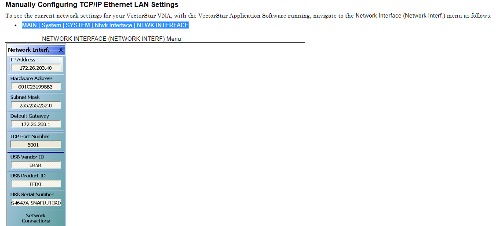

This repo shows the code used for Receiver Calibration using [beaglebone black (BBB)](https://beagleboard.org/black) and VectorStar MS4640A VNA.

<div align="center">
  
| File | Description |
|---|---|
| [drive_module.py](https://github.com/SitwalaM/cefim_vna_beagle/blob/main/scripts/drive_module.py) | Main modules that are used to drive the GPIOs|
| [test_vna.py](https://github.com/SitwalaM/cefim_vna_beagle/blob/main/scripts/test_vna.py) | main script that drives digital attenuators from GPIO and saves trace on VNA for each state|
|[led_blink.py](https://github.com/SitwalaM/cefim_vna_beagle/blob/main/scripts/led_blink.py)  | example code to blink LEDs on beaglebone |
  
</div>

# 1. PyViSA

The core of communicating with intruments using Standard Commands for Programmable Instruments(SCPI) using python is the python package [PyVISA](https://pyvisa.readthedocs.io/en/latest/introduction/getting.html). To be able to run PyVISA on the beaglebone black, you will have to remove all unneccesary installations that come with the board like Cloud9 IDE to make space available. For internet connections see intructions [here](https://ofitselfso.com/BeagleNotes/HowToConnectBeagleboneBlackToTheInternetViaUSB.php). Install required python packages using the following:

```bash
  pip install -r requirements.txt 
```

# 2. Networking Setup for VNA and Board

In this application, the BBB is connected to the VNA via ethernet LAN port. You will have to set the IP address on both the VNA and the BBB to be able to communicate. The VNA IP address is setup as follows: MAIN | System | SYSTEM | Netwk Interface | NETWORK INTERFACE . Further instructions on setting up the IP on the VNA can be found [here](https://dl.cdn-anritsu.com/en-us/test-measurement/files/Manuals/Operation-Manual/10410-00266L.pdf). (Section 2-18)

<div align="center">
  

  
</div>

Similarly, you will have to setup a static IP on the BBB using instructions [here](https://ofitselfso.com/Beagle/NetworkingSetupConnectingTheBeagleboneBlack.php#:~:text=The%20ethernet%20cable%20should%20be,prompt%20on%20the%20LXDE%20Window.). Make sure the IPs on the VNA and the BBB are on the same networks. You can test connectivity by pinging the VNA.

# 3. Getting Instrument Connection ID

The instrument should show up with the following commands;

```bash
# list connections using pyvisa
import pyvisa

rm = pyvisa.ResourceManager()
print(rm.list_resources())
```
However, if this doesn't work, you will need to get the instrument connection ID on your PC using the [NI VISA](https://www.ni.com/en-za/support/downloads/drivers/download.ni-visa.html#460225). In my case the instrument name was 'TCPIP0::10.0.0.2::5001::SOCKET'. I was then able to setup the connection using:

```bash
# list connections using pyvisa
import pyvisa

rm = pyvisa.ResourceManager()
inst = rm.open_resource('TCPIP0::10.0.0.2::5001::SOCKET')
# print instrument IDN
print(inst.query("*IDN?"))
```
